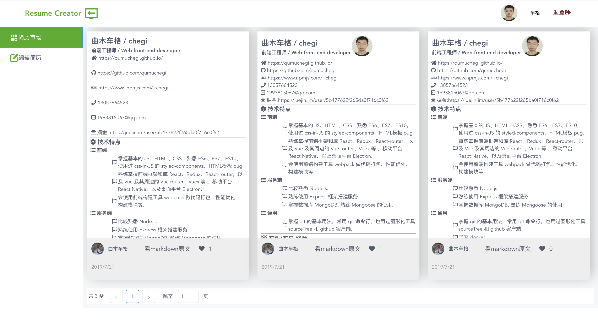

# vue-resume-creator
使用 Vue 制作的简历生成器

## 一、亮点

1. 后端结合使用 OAuth2.0 和 JWT 授权，OAuth 和 JWT_auth 是两个中间件，分别对 OAuth2.0 和 JWT 签发的 token 验证，其中 OAuth 验证成功就跳过 JWT_auth，失败则交给 JWT_auth 来验证：

```javascript
router.get('/myresumes', OAuth, JWT_auth, (req,res) =>{})
```
2. 前端使用 Vue + vue router + vuex；

3. 前端使用了一些 html 和图片、pdf 之间转换的库，对 HTML 的 Blob 、File API有了更深的理解。

## 二、开发

`npm run serve` 开启 Vue 前端构建服务

`npm run server` 开启后端 express 服务

## 三、预览
1. 可以使用密码登录，也可以使用 github 账号登录：


2. 使用 markdown 编辑简历，并可以下载图片和pdf、分享：


3. 简历市场，可以发现其他人上传的简历并点赞收藏：



## 四、部署

1. 部署之前先确认前后端 api 通信接口端口一致，比如前端请求端口为 80, 则后端 express 监听端口也应该为 80。这里我使用 express 将静态的打好包的前端项目的 index.html 响应给浏览器，所以后端接口监听端口和网页请求端口都是 80，所以不存在不同端口的跨域问题。

2. 前端打包：使用 `npm run build` 可让 vue-cli 打包 vue 项目，生成一个 dist 目录。

3. 将 dist 目录移动到 后端代码目录 server，并在后端代码 app.js 增加一个浏览器可以获取 dist 里 index.html 的响应：

```js

app.use(express.static(path.join(__dirname, 'dist')))

app.get('/', (req,res) => 
    res.send(require('./dist/index.html'))
)

```

4. 将后端代码目录 server （包含前端打包文件 dist ）传输到云服务器：` scp -r server root@XXXX.XXXX.XX.XX` ，这里 root@XXXX.XXXX.XX.XX 是服务器地址。

5. 测试：浏览器请求 XXXX.XXXX.XX.XX （服务器地址）即可访问到 打好包的 vue 项目的 index.html.

6. 保持后端 node 代码运行，而不会因为关掉启动服务的命令行界面二是服务关停，可以全局安装 `pm2`： `npm i -g pm2`,然后 使用 pm2 代替 node 运行服务即可。可能会遇到 找不到 pm2 的报错，此时可以运行 `ln -s [pm2安装地址] [/usr/bin/pm2]`，比如 `ln -s ~/node-v9.3.0-linux-x64/bin/pm2 /usr/bin/pm2`


