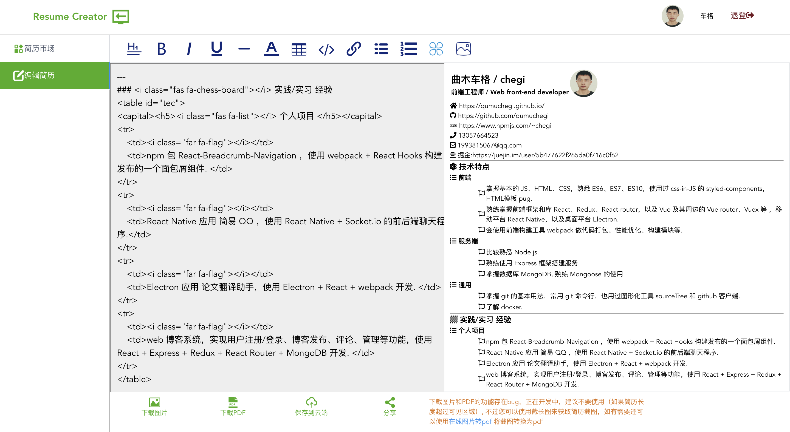

# vue-resume-creator
使用 Vue 制作的简历生成器

## 开发

`npm run serve` 开启 Vue 前端构建服务

`npm run server` 开启后端 express 服务

## 预览
1. 可以使用密码登录，也可以使用 github 账号登录：

2. 使用 markdown 编辑简历，并可以下载图片和pdf、分享：

3. 简历市场，可以发现其他人上传的简历并点赞收藏：

